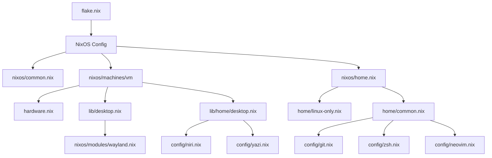

# nixconf

Personal Nix / NixOS / nix-darwin configuration based on [Nix Flakes](https://nixos.wiki/wiki/Flakes), using [Home Manager](https://nix-community.github.io/home-manager/) to manage user environments.

## Overview

A set of declarative configurations covering the following scenarios:

- **NixOS** — Full system configuration for a Hyper-V virtual machine
- **macOS** — System preferences managed via nix-darwin
- **Other Linux distros** — Rootless deployment via Home Manager

### Key Features

| Category | Details |
|----------|---------|
| **Shell** | Zsh + syntax highlighting + autosuggestions + handy aliases |
| **Editor** | Neovim (with vi/vim aliases) |
| **Version Control** | Git user-level config |
| **File Manager** | Yazi terminal file manager (custom Catppuccin-style theme) |
| **Desktop** | Wayland (Niri compositor + Alacritty terminal) |
| **System** | OpenSSH, NetworkManager, en/zh locale support |

---

## Directory Structure

```
nixconf/
├── flake.nix                     # 🔧 Flake entry point — defines all outputs
├── .gitignore                    # Ignores result/
│
├── nixos/                        # 🐧 NixOS system configuration
│   ├── common.nix                #   System-wide configuration
│   ├── home.nix                  #   Home Manager entry for NixOS
│   ├── machines/
│   │   └── vm/                   #   Hyper-V virtual machine
│   │       ├── default.nix       #     Host configuration
│   │       └── hardware.nix      #     Hardware config (auto-generated)
│   └── modules/
│       └── wayland.nix           #   Wayland xdg-portal
│
├── darwin/                       # 🍎 macOS (nix-darwin) configuration
│   ├── common.nix                #   macOS system preferences
│   ├── home.nix                  #   Home Manager entry for macOS
│   └── machines/
│       └── macbook/
│           └── default.nix       #   MacBook-specific config
│
├── home/                         # 🏠 Cross-platform Home Manager configs
│   ├── common.nix                #   Shared across all platforms (git, zsh, neovim)
│   ├── linux-only.nix            #   Linux-only packages
│   ├── darwin-only.nix           #   macOS-only packages (includes yazi)
│   └── config/
│       ├── git.nix               #   Git user config
│       ├── zsh.nix               #   Zsh config (plugins + aliases + prompt)
│       ├── neovim.nix            #   Neovim config
│       ├── niri.nix              #   Niri Wayland compositor
│       └── yazi.nix              #   Yazi file manager theme
│
├── lib/                          # 📦 Reusable meta-modules
│   ├── desktop.nix               #   Desktop meta-module (imports Wayland)
│   └── home/
│       └── desktop.nix           #   Home Manager desktop meta-module (imports niri + yazi)
│
└── other/                        # 🐧 Other Linux distributions
    └── home.nix                  #   Standalone Home Manager entry
```

---

## Module Architecture



---

## Usage

### Prerequisites

- [Nix](https://nixos.org/download.html) installed with Flakes enabled
- (NixOS) NixOS installed
- (macOS) [nix-darwin](https://github.com/LnL7/nix-darwin) installed

### NixOS (Hyper-V VM)

```bash
# Clone the repository
git clone <repo-url> ~/nixconf

# Build and switch (using hostname 'nixos')
sudo nixos-rebuild switch --flake ~/nixconf#nixos
```

### Other Linux / macOS (Home Manager only)

```bash
# Standalone Home Manager deployment
home-manager switch --flake ~/nixconf#<user>@<hostname>
```

---

## System Details

| Setting | Value |
|---------|-------|
| **Architecture** | x86_64-linux |
| **Nix Channel** | nixos-unstable |
| **Timezone** | Asia/Shanghai |
| **Default Locale** | en_US.UTF-8 |
| **Supported Locales** | en_US.UTF-8, zh_CN.UTF-8 |
| **Kernel** | linuxPackages_latest |
| **Bootloader** | systemd-boot (EFI) |
| **Networking** | NetworkManager |
| **SSH** | Enabled (key auth only) |
| **User** | mikro (wheel group) |
| **Editor** | Neovim / Vim |

---

## Customization

### Adding a New Machine

1. Create a new directory under `nixos/machines/` or `darwin/machines/`
2. Add a `default.nix` (and optionally `hardware.nix`)
3. Add a new configuration entry in `flake.nix` outputs

### Adding a New Module

Add a `.nix` file under `nixos/modules/` or `home/config/`, then import it from the relevant entry point.

---

## License

MIT
