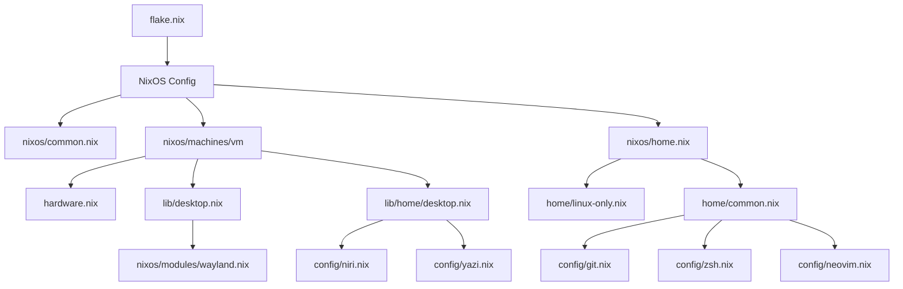

# nixconf

基于 [Nix Flakes](https://nixos.wiki/wiki/Flakes) 的个人 Nix / NixOS / nix-darwin 配置，使用 [Home Manager](https://nix-community.github.io/home-manager/) 管理用户环境。

## 概述

一套声明式配置，覆盖以下场景：

- **NixOS 系统** — Hyper-V 虚拟机上的完整系统配置
- **macOS 系统** — 通过 nix-darwin 管理系统偏好
- **其他 Linux 发行版** — 通过 Home Manager 无 root 部署

### 主要特性

| 类别 | 配置项 |
|------|--------|
| **Shell** | Zsh + 语法高亮 + 自动补全 + 实用别名 |
| **编辑器** | Neovim（带 vi/vim 别名） |
| **版本控制** | Git 用户级配置 |
| **文件管理** | Yazi 终端文件管理器（自定义 Catppuccin 风格主题） |
| **桌面** | Wayland (Niri 合成器 + Alacritty 终端) |
| **系统** | OpenSSH、NetworkManager、中英文 locale 支持 |

---

## 目录结构

```
nixconf/
├── flake.nix                     # 🔧 Flake 入口，定义所有输出
├── .gitignore                    # 忽略 result/
│
├── nixos/                        # 🐧 NixOS 系统配置
│   ├── common.nix                #   系统级通用配置
│   ├── home.nix                  #   NixOS 上的 Home Manager 入口
│   ├── machines/
│   │   └── vm/                   #   Hyper-V 虚拟机
│   │       ├── default.nix       #     主机配置
│   │       └── hardware.nix      #     硬件配置（自动生成）
│   └── modules/
│       └── wayland.nix           #   Wayland xdg-portal
│
├── darwin/                       # 🍎 macOS (nix-darwin) 配置
│   ├── common.nix                #   macOS 系统偏好
│   ├── home.nix                  #   macOS 上的 Home Manager 入口
│   └── machines/
│       └── macbook/
│           └── default.nix       #   MacBook 专属配置
│
├── home/                         # 🏠 跨平台 Home Manager 配置
│   ├── common.nix                #   所有平台共享（git, zsh, neovim）
│   ├── linux-only.nix            #   Linux 专有包
│   ├── darwin-only.nix           #   macOS 专有包（含 yazi）
│   └── config/
│       ├── git.nix               #   Git 用户配置
│       ├── zsh.nix               #   Zsh 配置（插件 + 别名 + 提示符）
│       ├── neovim.nix            #   Neovim 配置
│       ├── niri.nix              #   Niri Wayland 合成器
│       └── yazi.nix              #   Yazi 文件管理器主题
│
├── lib/                          # 📦 可复用元模块
│   ├── desktop.nix               #   桌面环境元模块（导入 Wayland）
│   └── home/
│       └── desktop.nix           #   Home Manager 桌面元模块（导入 niri + yazi）
│
└── other/                        # 🐧 其他 Linux 发行版
    └── home.nix                  #   独立 Home Manager 入口
```

---

## 模块架构



---

## 使用方法

### 前置条件

- 已安装 [Nix](https://nixos.org/download.html) 并启用 Flakes
- （NixOS）已安装 NixOS
- （macOS）已安装 [nix-darwin](https://github.com/LnL7/nix-darwin)

### NixOS (Hyper-V VM)

```bash
# 克隆仓库
git clone <repo-url> ~/nixconf

# 构建并切换（使用主机名 'nixos'）
sudo nixos-rebuild switch --flake ~/nixconf#nixos
```

### 其他 Linux / macOS (仅 Home Manager)

```bash
# 独立 Home Manager 部署
home-manager switch --flake ~/nixconf#<user>@<hostname>
```

---

## 系统详情

| 配置项 | 值 |
|--------|-----|
| **架构** | x86_64-linux |
| **Nix 频道** | nixos-unstable |
| **时区** | Asia/Shanghai |
| **默认 locale** | en_US.UTF-8 |
| **支持的 locales** | en_US.UTF-8, zh_CN.UTF-8 |
| **内核** | linuxPackages_latest |
| **引导加载器** | systemd-boot (EFI) |
| **网络** | NetworkManager |
| **SSH** | 启用（仅密钥认证） |
| **用户** | mikro (wheel 组) |
| **编辑器** | Neovim / Vim |

---

## 自定义

### 添加新机器

1. 在 `nixos/machines/` 或 `darwin/machines/` 下创建新目录
2. 添加 `default.nix`（和可选的 `hardware.nix`）
3. 在 `flake.nix` 的 `outputs` 中添加新的配置条目

### 添加新模块

在 `nixos/modules/` 或 `home/config/` 中添加 `.nix` 文件，然后在相应的入口文件中 import 它。

---

## 许可

MIT
